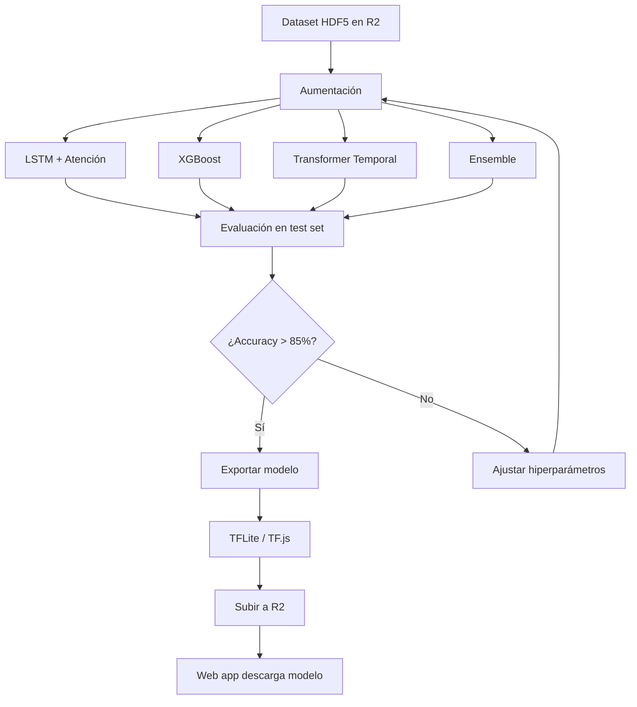

# AR Mirror Web — Plan de Evolución y Entrenamiento ML

## Visión General

Plataforma colaborativa de lengua de señas LSEC donde **usuarios autorizados** suben videos/imágenes de gestos, el sistema detecta y elimina duplicados, y los datos alimentan un pipeline de ML que entrena modelos cada vez más precisos. El modelo final se sirve desde un edge network y corre **100 % en el navegador del cliente** (sin servidor de inferencia).

---

## Arquitectura del Sistema

```
┌─────────────────────────────────────────────────────────────┐
│                   Cloudflare Pages                          │
│  ┌───────────────────────────────────────────────────────┐  │
│  │  AR Mirror Web (Three.js + MediaPipe + TF.js/ONNX)   │  │
│  │  - section-senias.js: reconocimiento en vivo          │  │
│  │  - section-vozsenias.js: voz a señas                  │  │
│  │  - admin panel: upload de videos (futuro)             │  │
│  └───────────────────────────────────────────────────────┘  │
└─────────────────────────────────────────────────────────────┘
                            │
              ┌─────────────┼──────────────┐
              ▼             ▼              ▼
┌──────────────────┐ ┌──────────┐ ┌──────────────┐
│  Cloudflare R2   │ │Supabase  │ │Cloudflare Wrks│
│  - videos        │ │ - auth   │ │ - upload API  │
│  - montajes.jpg  │ │ - users  │ │ - dedup hash  │
│  - modelos .tflite│ │ - labels │ │ - metadata    │
│  - datasets .h5  │ │ - hashes │ │               │
└──────────────────┘ └──────────┘ └──────────────┘
                            │
                            ▼
              ┌────────────────────────┐
              │  ML Training Pipeline  │
              │  (Colab / RunPod)      │
              │  LSTM · XGBoost · Tfm  │
              └────────────────────────┘
```

---

## Flujo Completo

### 1. Subida de Videos (usuarios autorizados)

```
Usuario autenticado → Panel de subida → Selecciona archivo + etiqueta
                                                    │
                                                    ▼
                              Cloudflare Worker recibe el archivo
                                                    │
                                    ┌───────────────┼───────────────┐
                                    ▼               ▼               ▼
                              Calcula         Guarda en      Registra en
                              SHA-256 hash    R2 temporal    Supabase:
                              del archivo     (pendiente)    user, label,
                                                    │         hash, fecha
                                                    ▼
                              ¿Hash existe en Supabase?
                              ┌─────┐          ┌─────┐
                              │ Sí  │          │ No  │
                              └──┬──┘          └──┬──┘
                                 ▼                ▼
                            No guardar        Mover a R2
                            duplicado →       permanente →
                            asociar label     actualizar
                            al hash existente  dataset flag
```

**Manejo de duplicados**:
- Todo archivo se hashea con SHA-256 al llegar
- Si el hash ya existe en la BD, se **descarta el archivo** y se asocia la nueva etiqueta al hash existente
- Esto asegura que aunque 10 personas suban el mismo video, solo se guarda 1 copia
- Las etiquetas múltiples para el mismo archivo se fusionan (útil para gestos idénticos)

### 2. Extracción de Landmarks (preprocesamiento)

```
Video en R2
    │
    ▼
Descargar temporalmente → MediaPipe Hands + FaceMesh
    │
    ├── Por cada frame:
    │   ├── 21 hand landmarks (x, y, z) normalizados
    │   ├── Pairwise distances (210)
    │   ├── Finger states (5 booleanos)
    │   ├── Palm size (1 float)
    │   ├── Face landmarks (opcional, ~120 puntos)
    │   └── Face metrics: mouth_open, eyebrow_raise, eye_open
    │
    └── Remuestrear secuencia a N frames fijos (N=16)
            │
            ▼
        Guardar en dataset HDF5/Parquet en R2
```

### 3. Pipeline de Entrenamiento ML



---

## Modelos para Pruebas Iniciales

### Baseline: KNN con Distancia Euclideana (actual)

El sistema actual ya implementa esto en `section-senias.js`. Sirve como baseline que los modelos ML deben superar.

- **Input**: pairwise_distances (210D) por frame
- **Métrica**: distancia coseno al frame más cercano
- **Votación**: ventana deslizante de 20 frames
- **Accuracy esperada**: ~60-70%

### Modelo 1: XGBoost (entrada estática por frame)

Ideal para primera iteración por su rapidez de entrenamiento y bajo costo computacional.

```
Features por frame (84-D):
  ├── 63 landmarks_norm
  ├── 10 ángulos de flexión de dedos
  ├── 5 finger states
  ├── 1 palm_size
  └── 5 face metrics (opcional)

Arquitectura:
  Input: [batch, 84 features]
  → XGBoost (n_estimators=500, max_depth=8, lr=0.1)
  → Softmax sobre C clases
  → Votación sobre ventana de N frames
```

- **Ventaja**: Entrena en segundos, no requiere GPU, feature importance interpretable
- **Desventaja**: No modela secuencias temporales explícitamente
- **Accuracy esperada**: ~70-80% (con votación temporal)

### Modelo 2: LSTM + Atención (secuencias)

```
Input: [batch, N_frames=16, 63]   (landmarks_norm)
  → LSTM(128, return_sequences=True)
  → Dropout(0.3)
  → Attention(units=64)
  → LSTM(64)
  → Dropout(0.3)
  → Dense(32, ReLU)
  → Dense(num_clases, Softmax)

Pérdida: CategoricalCrossentropy
Optimizador: Adam (lr=1e-3 → 1e-4 con cosine decay)
Épocas: 100 con early stopping (patience=15)
```

- **Input alternativo**: 73-D (63 landmarks + 10 angles) o 84-D (full)
- **Ventaja**: Modela la dinámica temporal del gesto
- **Desventaja**: Requiere más datos, entrena más lento
- **Accuracy esperada**: ~80-90%

### Modelo 3: Transformer Temporal

```
Input: [batch, N_frames=16, d_model=84]
  → PositionalEncoding(sinusoidal)
  → TransformerEncoder(num_layers=4, d_model=128, num_heads=4, ff_dim=256)
  → GlobalAveragePooling1D
  → Dropout(0.2)
  → Dense(64, ReLU)
  → Dense(num_clases, Softmax)
```

- **Ventaja**: Captura dependencias lejanas en la secuencia, paralelizable
- **Desventaja**: Necesita más datos que LSTM, más hiperparámetros
- **Accuracy esperada**: ~85-92%

### Modelo 4: Ensemble (XGBoost + LSTM)

```
XGBoost: logits de 84 features por frame → promedio temporal
LSTM:    logits de secuencia completa
Concatenate → Dense(64) → Dense(C) → Softmax

Pesos: 0.3 × XGBoost + 0.7 × LSTM (ajustable)
```

- **Ventaja**: Lo mejor de ambos mundos (features estáticas + secuencia)
- **Desventaja**: Mayor complejidad de deployment
- **Accuracy esperada**: ~87-95%

### Modelo 5: Distancia Euclideana con Embedding Aprendido (Siamese)

```python
# Red siamesa: aprende un embedding de 64-D por frame
# La cercanía en espacio embedding = mismo gesto

Input: [batch, 63] (un frame)
  → Dense(128, ReLU)
  → Dense(64, ReLU)  # embedding
  → L2-normalize

Pérdida: TripletLoss (anchor, positive, negative)
```

- **Ventaja**: Robusto a gestos no vistos, embedding reutilizable
- **Desventaja**: Entrenamiento más complejo (minería de tripletes)
- **Accuracy esperada**: ~80-88%

---

## Features de Entrada

| Feature | Dimensión | Pipeline | Descripción |
|---------|-----------|----------|-------------|
| `landmarks_norm` | 63 | Todos | (x,y,z) normalizados por muñeca y escala de palma |
| `pairwise_distances` | 210 | XGBoost | Distancias entre pares de landmarks |
| `finger_state` | 5 | XGBoost | Pulgar/índice/medio/anular/meñique (1 = extendido) |
| `angles` | 10 | XGBoost | Coseno de ángulo de flexión (2 por dedo) |
| `palm_size` | 1 | XGBoost | Escala absoluta de la palma |
| Face `metrics` | ~6 | Opcional | mouth_open, eyebrow_raise, eye_open por lado |
| `velocity` | 63 | LSTM/TFM | Delta de landmarks entre frames consecutivos |

### Pipelines recomendados por modelo

| Modelo | Pipeline | Dimensión |
|--------|----------|-----------|
| KNN (baseline) | pairwise_distances | 210 |
| XGBoost | landmarks + angles + finger + palm | 79–85 |
| LSTM | landmarks + velocity | 126 |
| Transformer | landmarks + angles + velocity | 136 |
| Ensemble | XGBoost (84) + LSTM (126) | Ensemble |

---

## Stack Tecnológico

### Hosting y Almacenamiento

| Servicio | Uso | Costo |
|----------|-----|-------|
| **Cloudflare Pages** | Hostear app estática | $0 (banda ancha ilimitada) |
| **Cloudflare R2** | Videos, imágenes, modelos, datasets | $0.015/GB/mes, egress $0 |
| **Supabase** | Auth + DB (usuarios, labels, hashes) | $0 (50k usuarios, 500 MB DB) |
| **Cloudflare Workers** | API de subida, dedup, metadata | $0 (100k req/día) |

### ML Training

| Herramienta | Uso | Costo |
|-------------|-----|-------|
| **Google Colab** | Entrenamiento LSTM/Transformer (GPU T4) | $0 (Free) / $10/mes (Pro) |
| **RunPod / Vast.ai** | Entrenamiento intensivo (A100) | ~$0.25–0.50/hr |
| **MediaPipe** | Extracción de landmarks (Python) | $0 (open source) |
| **TensorFlow.js / ONNX** | Inferencia en navegador | $0 |

### Exportación

```
Modelo entrenado (Keras / PyTorch)
    │
    ├── TF-Lite (int8 quantized) → < 2 MB → mejor para mobile
    ├── TF.js GraphModel          → < 5 MB → mejor para web desktop
    └── ONNX                      → < 5 MB → framework-agnóstico
            │
            ▼
        Subir a Cloudflare R2
        → `lib/lsec_model/model.tflite`
        → `lib/lsec_model/labels.json`
```

---

## Integración Web

### Fase 1: Reemplazar matching actual por modelo ML

En `js/section-senias.js`, reemplazar `matchGestureFrame()`:

```javascript
import * as tf from '@tensorflow/tfjs';

let model = null;
let labelMap = null;

async function loadMLModel() {
    const modelUrl = 'https://pub-xxxx.r2.dev/lib/lsec_model/tfjs/model.json';
    model = await tf.loadGraphModel(modelUrl);
    const resp = await fetch('https://pub-xxxx.r2.dev/lib/lsec_model/labels.json');
    labelMap = await resp.json();
}

function matchGestureML(landmarks_norm) {
    const input = tf.tensor([landmarks_norm.flat()]);  // [1, 63]
    const pred = model.predict(input);                  // [1, num_clases]
    const idx = pred.argMax(1).dataSync()[0];
    return { word: labelMap[idx], confidence: pred.max().dataSync()[0] };
}
```

### Fase 2: Buffer de secuencia para LSTM/Transformer

```javascript
const frameBuffer = [];
const BUFFER_SIZE = 16;

function appendFrame(landmarks_norm) {
    frameBuffer.push(landmarks_norm.flat());
    if (frameBuffer.length > BUFFER_SIZE) frameBuffer.shift();

    if (frameBuffer.length === BUFFER_SIZE) {
        const seq = tf.tensor([frameBuffer]);  // [1, 16, 63]
        const pred = model.predict(seq);
        // ...
    }
}
```

### Fase 3: Actualizar Voz a Señas

El `section-vozsenias.js` puede beneficiarse del mismo modelo para enriquecer la detección de gestos desde la voz, y también usar el pipeline de subida para que usuarios autorizados agreguen nuevos gestos al sistema.

---

## Métricas de Éxito

| Métrica | Baseline | ML Target | Óptimo |
|---------|----------|-----------|--------|
| Accuracy top-1 (test) | ~65% | > 85% | > 92% |
| Accuracy top-3 (test) | ~80% | > 95% | > 98% |
| Inferencia (navegador) | < 5ms | < 20ms | < 10ms |
| Tamaño modelo | N/A | < 5 MB | < 2 MB |
| Nuevos gestos por upload | Manual | Automático | Con feedback loop |
| Duplicados detectados | Manual | 100% automático | Hash + contenido |

---

## Plan de Implementación por Fases

### Fase 0: Fundación (actual)
- [x] Diccionario de letras (abecedario) con landmarks
- [x] Diccionario de gestos por módulo (03–10)
- [x] Matching por distancia euclideana + votación
- [x] Voz a señas con cola de reproducción
- [x] Pipeline de extracción de landmarks (Python)

### Fase 1: Dataset + Primer Modelo
- [ ] Script `extract_ml_dataset.py`: procesar VIDEOS/ y generar HDF5
- [ ] Aumentación: ruido, escalado, rotación, time-warping
- [ ] Entrenar XGBoost como primer modelo ML
- [ ] Evaluar contra baseline KNN
- [ ] Exportar a TF.js e integrar en web

### Fase 2: Modelos Secuenciales
- [ ] Entrenar LSTM + Atención
- [ ] Entrenar Transformer Temporal
- [ ] Comparar todos los modelos en test set unificado
- [ ] Seleccionar mejor modelo y exportar

### Fase 3: Plataforma Colaborativa
- [ ] Supabase: setup de auth + DB + schema
- [ ] Cloudflare Worker: endpoint de upload con hasheo SHA-256
- [ ] Panel de administración en la web
- [ ] Integración dedup: hash existente → reetiquetar
- [ ] Pipeline de re-entrenamiento automático periódico

### Fase 4: Feedback Loop
- [ ] Los gestos mal clasificados se marcan para revisión
- [ ] Los gestos marcados entran al siguiente ciclo de training
- [ ] Modelo se actualiza en R2 sin downtime
- [ ] Web app detecta nueva versión y la descarga

---

## Costos Estimados Mensuales

| Escenario | Cloudflare | Supabase | GPU | Total |
|-----------|------------|----------|-----|-------|
| MVP (solo dev local) | $0 | $0 | $0 (Colab Free) | **$0** |
| Beta (10 auth users, 200 videos) | ~$3 (R2) | $0 | ~$10 (Colab Pro) | **~$13** |
| Producción (50 auth, 2000 videos, 10k visits) | ~$30 (R2) | $25 (Pro) | ~$25 (RunPod) | **~$80** |
| Escalado (500 auth, 10k videos, 100k visits) | ~$150 (R2) | $75 (Team) | ~$100 (GPU dedicada) | **~$325** |

---

## Scripts del Pipeline

| Script | Propósito |
|--------|-----------|
| `public/extract_ml_dataset.py` | Procesa videos de R2/local y genera dataset HDF5 con landmarks |
| `public/train_gesture_model.py` | Entrena XGBoost, LSTM y Transformer, guarda métricas |
| `public/evaluate_gesture_model.py` | Evalúa en test set: accuracy, F1, matriz de confusión |
| `public/export_model.py` | Exporta a TF-Lite / TF.js / ONNX y sube a R2 |
| `public/dedup_hasher.py` | Calcula SHA-256 y detecta duplicados en el dataset |

---

## Notas Técnicas

- **Inferencia 100 % client-side**: El modelo corre en el navegador con TF.js. No hay servidor de inferencia, no hay latencia de red, no hay costos de GPU continua.
- **Modelo < 100 MB**: Incluso el modelo más complejo (Transformer con 4 capas) pesa < 10 MB cuantizado. El límite de 100 MB de GitHub no aplica porque los modelos se sirven desde R2, no desde git.
- **Los landmarks son el formato portable**: Al extraer landmarks en lugar de trabajar con píxeles, el dataset es ~100× más pequeño que videos raw, y el modelo resultante es invariante a cámara, iluminación y fondo.
- **Duplicados por hash de contenido**: SHA-256 sobre el archivo completo, no sobre el nombre. Dos usuarios subiendo el mismo video desde distintas fuentes → mismo hash → 1 sola copia.
